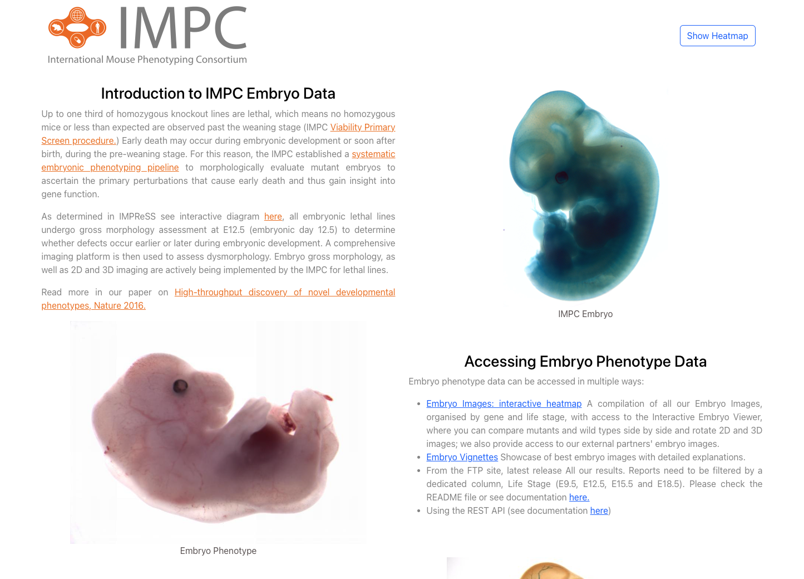

# IMPC Gene-Phenotype

- [Live-Demo](https://impc-mouse-phenotyping.vercel.app/)


&nbsp;

# How to start this project!

## Note This project was created using node version **v18.4.0**

## clone the branch

```
git clone https://github.com/Milan-960/EBI-IMPC-Mouse-Phenotyping.git
```

## Install dependecies

```
yarn install
# or
npm install
```

## run on the localhost

```
yarn start
# or
npm start
```
