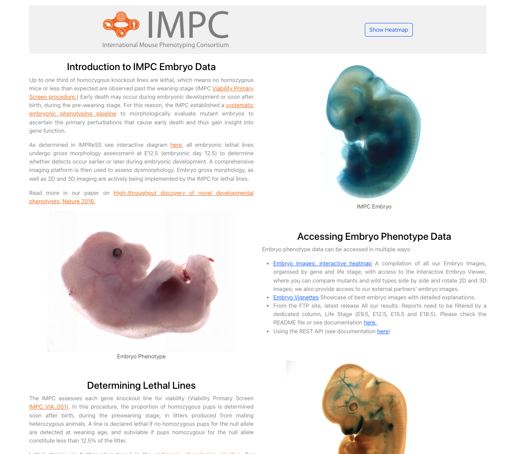
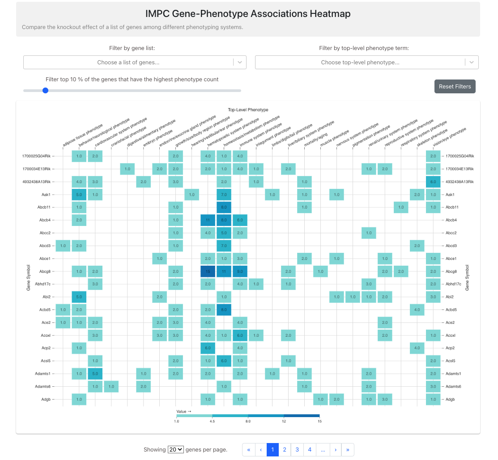

# **IMPC Gene-Phenotype Associations Heatmap**

- [Live-Demo](https://impc-mouse-phenotyping.vercel.app/)

### LandingPage


&nbsp;

### HeatMap


&nbsp;

## Folder Structure!

```
📦ebi-impc-mouse
 ┣ 📂public
 ┃ ┣ 📜favicon.ico
 ┃ ┣ 📜index.html
 ┃ ┣ 📜logo192.png
 ┃ ┣ 📜logo512.png
 ┃ ┣ 📜manifest.json
 ┃ ┗ 📜robots.txt
 ┣ 📂src
 ┃ ┣ 📂api
 ┃ ┃ ┗ 📜fetchData.ts
 ┃ ┣ 📂assets
 ┃ ┃ ┣ 📂img
 ┃ ┃ ┃ ┣ 📜IMPC-logo.png
 ┃ ┃ ┃ ┣ 📜embryo_image_1.jpeg
 ┃ ┃ ┃ ┣ 📜embryo_image_2.jpg
 ┃ ┃ ┃ ┗ 📜embryo_image_3.jpeg
 ┃ ┃ ┗ 📜.DS_Store
 ┃ ┣ 📂components
 ┃ ┃ ┣ 📜FilterControls.tsx
 ┃ ┃ ┗ 📜HeatmapPagination.tsx
 ┃ ┣ 📂hooks
 ┃ ┃ ┗ 📜useDebouncedFilters.tsx
 ┃ ┣ 📂pages
 ┃ ┃ ┣ 📜Heatmap.tsx
 ┃ ┃ ┗ 📜LandingPage.tsx
 ┃ ┣ 📂types
 ┃ ┃ ┗ 📜custom-types.ts
 ┃ ┣ 📂utils
 ┃ ┃ ┗ 📜transformData.ts
 ┃ ┣ 📜.DS_Store
 ┃ ┣ 📜App.css
 ┃ ┣ 📜App.test.tsx
 ┃ ┣ 📜App.tsx
 ┃ ┣ 📜index.css
 ┃ ┣ 📜index.tsx
 ┃ ┣ 📜react-app-env.d.ts
 ┃ ┣ 📜reportWebVitals.ts
 ┃ ┣ 📜service-worker.ts
 ┃ ┣ 📜serviceWorkerRegistration.ts
 ┃ ┗ 📜setupTests.ts
 ┣ 📜.DS_Store
 ┣ 📜.gitignore
 ┣ 📜README.md
 ┣ 📜package.json
 ┣ 📜tsconfig.json
 ┗ 📜yarn.lock
```

# **How to start this project!**

## Note This project was created using node version **v18.4.0**

## clone the branch

```
git clone https://github.com/Milan-960/EBI-IMPC-Mouse-Phenotyping.git
```

## Install dependecies

```
yarn install
# or
npm install
```

## run on the localhost

```
yarn start
# or
npm start
```

## Quick Info of the App!

---

## **This app allows users to compare the knockout effect of a list of genes among different phenotyping systems by visualizing the data using a heatmap. The app has the following main components!**

## 1. Heatmap

- The heatmap visualizes the relationship between genes, phenotypes, and phenotype systems. It is implemented using the ResponsiveHeatMapCanvas component from the @nivo/heatmap library. The heatmap displays gene symbols along the Y-axis and top-level phenotype terms along the X-axis. The cells are color-coded based on the count of significant phenotypes associated with the given gene and the given top-level phenotype or phenotype system.

## 2. Filter Controls

- The filter controls component allows users to filter the data by a list of genes, top-level phenotype terms, or the top percentage of genes that have the highest count of phenotype associations. The app has a custom hook called useDebouncedFilters which debounces the applyFilters function to avoid excessive updates.

## 3. Pagination

- The heatmap pagination component helps users navigate through large datasets efficiently without compromising the performance of the application and the filtered gene-phenotype data. Users can set the number of genes to be displayed per page using a dropdown menu. The pagination controls allow users to move between pages.

## 4. Data Fetching and Transformation

- The fetchData function retrieves the dataset for this task, which is a subset of IMPC Gene-Phenotype associations containing phenotyping data for the first 1000 genes ordered by the number of significant phenotype associations. The transformData function processes the raw data to generate a format suitable for rendering the heatmap.

## 5. Technologies and Libraries

- The app is built using React, TypeScript, and Bootstrap. The heatmap visualization is created using the @nivo/heatmap library.

---

## **A brief description of conceptual and technical decision which I have made!**

## 1. Conceptual decisions:

- Heatmap visualization: A heatmap was chosen as the primary visualization method due to its ability to effectively represent the relationship between genes, phenotypes, and phenotype systems in a visually appealing and easy-to-understand manner.

- Filtering options: To provide users with the flexibility to explore the data based on their specific requirements, various filtering options were introduced, such as filtering by a list of genes, top-level phenotype terms, or the top percentage of genes with the highest count of phenotype associations.

- Pagination: In order to keep the heatmap manageable and uncluttered, pagination was implemented to allow users to navigate through the filtered gene-phenotype data easily. Users can also control the number of genes displayed per page to suit their preferences.

## 2. Technical decisions:

- React: React was chosen as the primary framework for developing the app due to its efficiency, flexibility, and its wide adoption in the industry.

- TypeScript: TypeScript was used for the React codebase to enable static typing and improve code maintainability, scalability, and overall quality.

- Bootstrap: The app's layout and styling were implemented using the Bootstrap library to provide a consistent and responsive user interface.

- Nivo heatmap library: The @nivo/heatmap library was chosen for creating the heatmap visualization because of its ease of integration with React, extensive customization options, and excellent performance.

- Data fetching and transformation: Custom functions (fetchData and transformData) were implemented to fetch the dataset and transform it into the desired format for rendering the heatmap.

- Debouncing filters: The app uses a custom hook called useDebouncedFilters to debounce the applyFilters function, ensuring that filtering updates are applied efficiently without causing excessive re-renders.

By making these conceptual and technical decisions, the app effectively addresses the user's needs while offering a smooth, interactive, and visually engaging experience.

---

## **PS: Here are some key findings ideas we can add!**

## 1. Search functionality:

- Implement a search feature that allows users to search for specific genes or top-level phenotype terms quickly and efficiently.

## 2. Customizable heatmap:

- Allow users to customize the heatmap's appearance, such as the color scale, grid options, and tooltip content, to create a more personalized experience.

## 3. Export functionality:

- Provide users with the option to export the filtered heatmap data or the heatmap visualization itself in various formats, such as CSV, JSON, or SVG/PNG.

## 4. Integration with external resources:

- Link the app to external databases, such as the Mouse Genome Informatics (MGI) database, to provide users with additional gene and phenotype information.

## 5. Performance optimizations:

- Continuously monitor the app's performance and implement necessary optimizations, such as lazy loading, virtualization, or server-side rendering, to improve the loading times and overall responsiveness.

## 6. User authentication:

- Introduce user authentication to allow users to save their filtering preferences, customizations, and any other personalized settings.

By implementing some or all of these enhancements, the app can provide an even more comprehensive, interactive, and user-friendly experience for exploring gene-phenotype associations!!

---

## **Here are the links to the branches!**

[Master](https://github.com/Milan-960/EBI-IMPC-Mouse-Phenotyping)

[Develop](https://github.com/Milan-960/EBI-IMPC-Mouse-Phenotyping/tree/develop)
